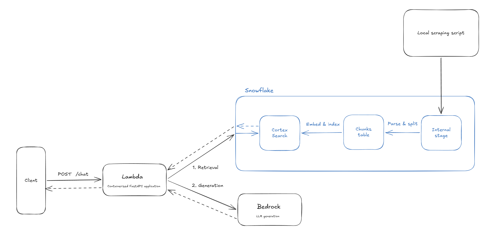

# RAG evaluation

A lightweight evaluation pipeline for a simple, mock RAG application.

## RAG pipeline

A high-level picture of the system's architecture.

## Evaluation pipeline

I don't know yet. My focus for day #1 is to build a RAG application so tomorrow I can explore evaluation.